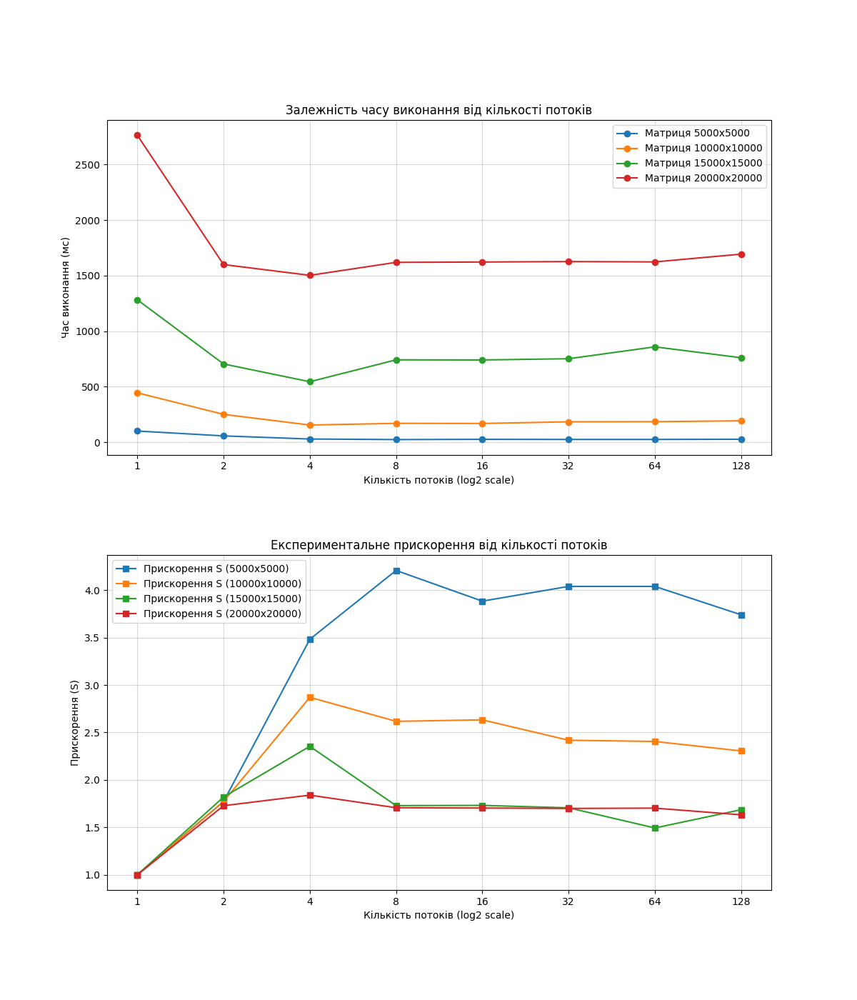

# Звіт з лабораторної роботи №1


## Дослідження базових операцій з потоками виконання


### 1. Мета роботи
Розглянути основні операції з потоками виконання,
навчитися використовувати неблокуючу паралелізацію для вирішення
найпростіших математичних задач, використовуючи обрану мову
програмування. Навчитися досліджувати та оцінювати ефективність
паралелізації алгоритму.


### 2. Завдання (Варіант 12)
Заповнити квадратну матрицю випадковими числами. На побічній діагоналі розмістити добуток елементів, які лежать в тому ж стовпці.


### 3. Характеристики тестової системи
- *Процесор*: Apple M1 (8 фізичних ядер).
- *Архітектура*: Гетерогенна ($aarch64$); 4 високопродуктивні ядра (P-cores) та 4 енергоефективні ядра (E-cores).
- *Потоки*: 8 логічних ядер; технології SMT/Hyper-threading відсутні (1 потік на 1 фізичне ядро).
- *ОС*: Mac OS X.


### 4. Результати експериментів
```
=== Характеристики системи ===
ОС: Mac OS X
Архітектура: aarch64
Логічні ядра: 8
Фізичні ядра: 8
========================================

Обробка матриці 5000x5000
  > Потоків: 1   | Сер. час (10 іт.): 101 ms
  > Потоків: 2   | Сер. час (10 іт.): 57 ms
  > Потоків: 4   | Сер. час (10 іт.): 29 ms
  > Потоків: 8   | Сер. час (10 іт.): 24 ms
  > Потоків: 16  | Сер. час (10 іт.): 26 ms
  > Потоків: 32  | Сер. час (10 іт.): 25 ms
  > Потоків: 64  | Сер. час (10 іт.): 25 ms
  > Потоків: 128 | Сер. час (10 іт.): 27 ms
Обробка матриці 10000x10000
  > Потоків: 1   | Сер. час (10 іт.): 445 ms
  > Потоків: 2   | Сер. час (10 іт.): 251 ms
  > Потоків: 4   | Сер. час (10 іт.): 155 ms
  > Потоків: 8   | Сер. час (10 іт.): 170 ms
  > Потоків: 16  | Сер. час (10 іт.): 169 ms
  > Потоків: 32  | Сер. час (10 іт.): 184 ms
  > Потоків: 64  | Сер. час (10 іт.): 185 ms
  > Потоків: 128 | Сер. час (10 іт.): 193 ms
Обробка матриці 15000x15000
  > Потоків: 1   | Сер. час (10 іт.): 1283 ms
  > Потоків: 2   | Сер. час (10 іт.): 705 ms
  > Потоків: 4   | Сер. час (10 іт.): 545 ms
  > Потоків: 8   | Сер. час (10 іт.): 742 ms
  > Потоків: 16  | Сер. час (10 іт.): 741 ms
  > Потоків: 32  | Сер. час (10 іт.): 752 ms
  > Потоків: 64  | Сер. час (10 іт.): 859 ms
  > Потоків: 128 | Сер. час (10 іт.): 761 ms
Обробка матриці 20000x20000
  > Потоків: 1   | Сер. час (10 іт.): 2765 ms
  > Потоків: 2   | Сер. час (10 іт.): 1600 ms
  > Потоків: 4   | Сер. час (10 іт.): 1503 ms
  > Потоків: 8   | Сер. час (10 іт.): 1620 ms
  > Потоків: 16  | Сер. час (10 іт.): 1623 ms
  > Потоків: 32  | Сер. час (10 іт.): 1627 ms
  > Потоків: 64  | Сер. час (10 іт.): 1624 ms
  > Потоків: 128 | Сер. час (10 іт.): 1694 ms
```



### 5. Аналіз результатів та висновки

#### 5.1. Ефективність паралелізації
Застосування багатопотоковості забезпечує суттєве скорочення часу обробки даних порівняно з послідовним виконанням. Найкращі показники продуктивності зафіксовані при використанні **4 потоків**. Це пояснюється архітектурними особливостями Apple M1: перші 4 потоки займають високопродуктивні P-ядра з вищою частотою та більшим обсягом кешу.

#### 5.2. Вплив гетерогенності та синхронізації
Використання методу `join()` реалізує бар’єрну синхронізацію. При задіянні 8 потоків частина навантаження переноситься на енергоефективні E-ядра. Оскільки ці ядра працюють повільніше, основний потік очікує завершення найповільнішого потоку, що обмежує загальний коефіцієнт прискорення.

#### 5.3. Деградація при надмірній кількості потоків
Збільшення кількості потоків понад кількість фізичних ядер (16–128) призводить до стабілізації або зростання часу виконання. Це зумовлено такими факторами:

- *Зміна контексту (Context Switching)*: Операційна система змушена часто перемикати ресурси CPU між потоками, що вимагає збереження стану регістрів та стеку.

- *Інвалідація кешу*: Операція зміни контексту є «найдорожчою», оскільки вона призводить до очищення кешів усіх рівнів, знижуючи ефективність доступу до даних у RAM.

- *Конкуренція за шину даних*: Задача є Memory-bound, тому велика кількість потоків створює черги на рівні контролера пам'яті.

Для досягнення максимальної швидкодії на гібридних архітектурах оптимальна кількість потоків повинна відповідати кількості фізичних продуктивних ядер. Це дозволяє уникнути деградації через зміну контексту та нерівномірний розподіл навантаження між ядрами різного типу.
