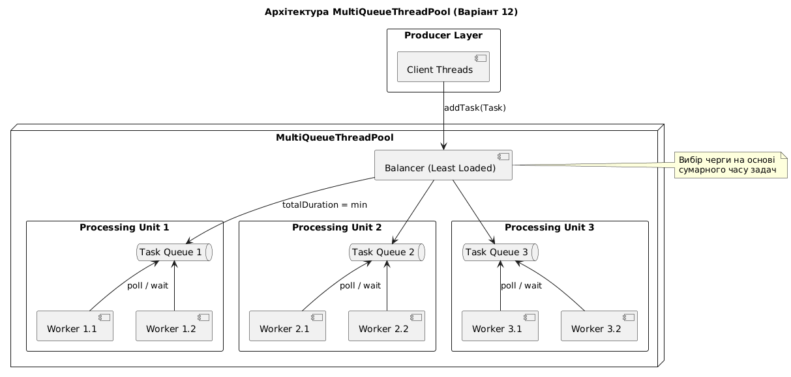

# Звіт з лабораторної роботи №2


## Дослідження базових примітивів синхронізації


### 1. Мета роботи
Розглянути базові примітиви синхронізації та їх особливості,
в залежності від обраної мови програмування. Розглянути підходи до
побудови ПЗ з використанням паралелізму та ознайомитися з класичною
задачею паралелізму у вигляді пулу потоків. 


### 2. Завдання (Варіант 12)
Пул потоків містить три черги, кожна з яких обслуговується 2-ма
робочими потоками. Задачі в чергу виконання додаються через один
інтерфейс (користувач не має явного доступу до черг виконання). Задачі
додаються відразу в кінець найменш завантаженої по часу (черга з
задачами, чий сумарний час виконання менший) черги виконання. Задача
займає випадковий час від 5 до 20 секунд. 


### 3. Опис реалізації

Для візуалізації взаємодії між компонентами пулу використано діаграму компонентів, що відображає розподіл задач між трьома незалежними обчислювальними вузлами:



#### Відповідно до 12-го варіанту, імплементація включає наступні аспекти:

- Пул містить 3 окремі черги задач, кожна з яких обслуговується власною парою робочих потоків (разом 6 потоків-робітників). Це дозволяє паралельно обробляти задачі з різних черг без блокування всієї системи

- Використовується алгоритм «найменшого часового навантаження». При додаванні задачі система аналізує метадані кожної черги (`totalDuration`) і обирає ту, де сумарний прогнозний час виконання задач є мінімальним.

- Користувач взаємодіє лише з єдиним інтерфейсом `addTask`, не маючи прямого доступу до внутрішньої структури черг, що відповідає принципам проектування пулів потоків.

- Кожна задача має випадкову тривалість від *5* до *20* секунд. Для імітації корисного навантаження використано метод `Thread.sleep()`.

#### Система реалізує інтерфейс `MultiQueueThreadPool`, що включає такі методи :

- `initialize(queueCount, workerPerQueue)` — ініціалізація структури.

- `addTask(task)` — додавання задачі за алгоритмом найменшого навантаження.

- `terminate()` — коректне завершення роботи.

- `isWorking()` — опитування статусу пулу.

#### Для забезпечення безпеки паралелізму (*Thread-safety*) використано такі примітиви:

1. М'ютекс (`ReentrantReadWriteLock`): Захищає операції ініціалізації та термінації пулу, а також гарантує атомарність вибору черги балансувальником.


2. Умовні змінні (`Condition`): Реалізовано механізм сигналізації для кожного робітника. Потоки переходять у стан очікування, якщо їхня черга порожня, і активуються методом `signal()` при надходженні нової задачі саме в їхню чергу.

3. Локальна синхронізація черг: Кожна черга (`TaskQueueImpl`) має власний рівень блокувань для безпечного оновлення лічильника `totalDuration` під час додавання або вилучення задач.


### 4. Результати експериментів

Тривалість кожного тесту: 60 секунд. Кількість робітників: 6 (3 черги по 2 потоки).
Вивід програми:
```
Початок тестування багатопотокового пулу з різними режимами навантаження...

Запуск режиму: Low (Затримка: 20-30с)
Thread Worker-Q1-T0: Виконання задачі (тривалість: 8 сек)
Thread Worker-Q0-T1: Виконання задачі (тривалість: 9 сек)
Thread Worker-Q2-T1: Виконання задачі (тривалість: 10 сек)
Thread Worker-Q0-T1: Виконання задачі (тривалість: 7 сек)
Thread Worker-Q0-T0: Виконання задачі (тривалість: 14 сек)
Thread Worker-Q0-T1: Виконання задачі (тривалість: 15 сек)
Thread Worker-Q0-T1: Виконання задачі (тривалість: 8 сек)
Thread Worker-Q0-T0: Виконання задачі (тривалість: 19 сек)
Thread Worker-Q0-T1: Виконання задачі (тривалість: 20 сек)
--- Статистика ---
Середній час очікування: 1,36 сек
Середній час виконання: 12,23 сек
Ефективність задач: 90,01%
Продуктивність пулу: 0,15 задач/сек
Середня довжина черги: 0,20 задач
-----------------------------------

Запуск режиму: Optimal (Затримка: 8-12с)
Thread Worker-Q2-T1: Виконання задачі (тривалість: 5 сек)
Thread Worker-Q0-T0: Виконання задачі (тривалість: 10 сек)
Thread Worker-Q1-T0: Виконання задачі (тривалість: 10 сек)
Thread Worker-Q0-T0: Виконання задачі (тривалість: 5 сек)
Thread Worker-Q1-T1: Виконання задачі (тривалість: 9 сек)
Thread Worker-Q0-T1: Виконання задачі (тривалість: 20 сек)
Thread Worker-Q1-T1: Виконання задачі (тривалість: 6 сек)
Thread Worker-Q1-T0: Виконання задачі (тривалість: 15 сек)
Thread Worker-Q0-T0: Виконання задачі (тривалість: 19 сек)
Thread Worker-Q0-T1: Виконання задачі (тривалість: 10 сек)
Thread Worker-Q1-T1: Виконання задачі (тривалість: 9 сек)
Thread Worker-Q0-T0: Виконання задачі (тривалість: 7 сек)
Thread Worker-Q0-T1: Виконання задачі (тривалість: 5 сек)
Thread Worker-Q0-T0: Виконання задачі (тривалість: 7 сек)
Thread Worker-Q1-T0: Виконання задачі (тривалість: 16 сек)
Thread Worker-Q0-T1: Виконання задачі (тривалість: 9 сек)
Thread Worker-Q0-T0: Виконання задачі (тривалість: 8 сек)
Thread Worker-Q0-T1: Виконання задачі (тривалість: 7 сек)
Thread Worker-Q1-T1: Виконання задачі (тривалість: 15 сек)
Thread Worker-Q0-T0: Виконання задачі (тривалість: 15 сек)
--- Статистика ---
Середній час очікування: 1,30 сек
Середній час виконання: 10,35 сек
Ефективність задач: 88,82%
Продуктивність пулу: 0,33 задач/сек
Середня довжина черги: 0,43 задач
-----------------------------------

Запуск режиму: High (Затримка: 2-5с)
Thread Worker-Q0-T0: Виконання задачі (тривалість: 9 сек)
Thread Worker-Q1-T0: Виконання задачі (тривалість: 10 сек)
Thread Worker-Q0-T1: Виконання задачі (тривалість: 9 сек)
Thread Worker-Q2-T1: Виконання задачі (тривалість: 8 сек)
Thread Worker-Q0-T0: Виконання задачі (тривалість: 9 сек)
Thread Worker-Q0-T1: Виконання задачі (тривалість: 7 сек)
Thread Worker-Q2-T0: Виконання задачі (тривалість: 19 сек)
Thread Worker-Q1-T0: Виконання задачі (тривалість: 10 сек)
Thread Worker-Q1-T1: Виконання задачі (тривалість: 19 сек)
Thread Worker-Q0-T0: Виконання задачі (тривалість: 5 сек)
Thread Worker-Q2-T0: Виконання задачі (тривалість: 5 сек)
Thread Worker-Q2-T1: Виконання задачі (тривалість: 11 сек)
Thread Worker-Q0-T1: Виконання задачі (тривалість: 10 сек)
Thread Worker-Q0-T0: Виконання задачі (тривалість: 8 сек)
Thread Worker-Q1-T1: Виконання задачі (тривалість: 12 сек)
Thread Worker-Q0-T1: Виконання задачі (тривалість: 8 сек)
Thread Worker-Q2-T0: Виконання задачі (тривалість: 13 сек)
Thread Worker-Q1-T0: Виконання задачі (тривалість: 20 сек)
Thread Worker-Q2-T1: Виконання задачі (тривалість: 17 сек)
Thread Worker-Q0-T0: Виконання задачі (тривалість: 13 сек)
Thread Worker-Q0-T1: Виконання задачі (тривалість: 8 сек)
Thread Worker-Q2-T0: Виконання задачі (тривалість: 14 сек)
Thread Worker-Q0-T1: Виконання задачі (тривалість: 8 сек)
Thread Worker-Q1-T1: Виконання задачі (тривалість: 18 сек)
Thread Worker-Q1-T0: Виконання задачі (тривалість: 16 сек)
Thread Worker-Q2-T1: Виконання задачі (тривалість: 15 сек)
Thread Worker-Q1-T1: Виконання задачі (тривалість: 9 сек)
Thread Worker-Q1-T0: Виконання задачі (тривалість: 6 сек)
Thread Worker-Q0-T0: Виконання задачі (тривалість: 19 сек)
Thread Worker-Q2-T1: Виконання задачі (тривалість: 9 сек)
Thread Worker-Q2-T0: Виконання задачі (тривалість: 18 сек)
Thread Worker-Q0-T1: Виконання задачі (тривалість: 17 сек)
--- Статистика ---
Середній час очікування: 10,70 сек
Середній час виконання: 11,85 сек
Ефективність задач: 52,53%
Продуктивність пулу: 0,53 задач/сек
Середня довжина черги: 5,71 задач
-----------------------------------
```

Зведена таблиця результатів

| Параметр                      | Режим Low     | Режим Optimal   | Режим High     |
|-------------------------------|---------------|-----------------|----------------|
| Затримка генерації (с)        | 20–30         | 8–12            | 2–5            |
| Завершено задач               | 9             | 20              | 32             |
| Сер. час очікування (с)       | 1,36          | 1,30            | 10,70          |
| Сер. час виконання (с)        | 12,23         | 10,35           | 11,85          |
| Продуктивність (задач/c)      | 0,15          | 0,33            | 0,53           |
| Сер. довжина черги (задач)    | 0,20          | 0,43            | 5,71           |
| Ефективність задач            | 90,01%        | 88,82%          | 52,53%         |

Примітка: Середня довжина черги розрахована за законом Літтла: $\bar{L} = \lambda \cdot W$. Ефективність відображає співвідношення часу безпосереднього виконання до загального часу перебування задачі в системі.


### 5. Аналіз результатів та висновки

#### 5.1. Ефективність балансування
При низькому (*Low*) та оптимальному (*Optimal*) навантаженні система демонструє стабільно низький час очікування ($1,30–1,36$ сек). Логи виконання підтверджують рівномірний розподіл задач між чергами *Q0*, *Q1* та *Q2* різними потоками-робітниками. Це свідчить про коректну роботу алгоритму вибору найменш завантаженої черги за сумарним часом.

#### 5.2. Деградація продуктивності та пропускна здатність
У режимі високої інтенсивності (*High*) продуктивність пулу зросла до $0,53$ задач/сек, проте це призвело до насичення системи:

- Середній час очікування зріс до $10,70$ сек, що майже дорівнює середньому часу виконання задачі.

- Ефективність впала до $52,53%$, оскільки задачі проводять майже стільки ж часу в черзі, скільки в обробці.

- Середня довжина черги досягла $5,71$, що вказує на постійну наявність задач у буфері для кожного робочого потоку.

#### 5.3. Стабільність виконання
Середній час виконання задач ($T$) коливається в межах $10,35–12,23$ сек, що відповідає заданому діапазону ($5–20$ сек). Використання примітивів `ReentrantReadWriteLock` та `Condition` забезпечило відсутність станів гонитви та взаємних блокувань навіть при критичному навантаженні.

Реалізований пул потоків відповідає вимогам безпеки паралелізму. Використання декількох черг із балансуванням за часом дозволяє мінімізувати простій потоків-робітників при помірних навантаженнях, проте при надмірній інтенсивності вхідних запитів система потребує або збільшення кількості потоків, або впровадження механізмів обмеження черги (Backpressure).
