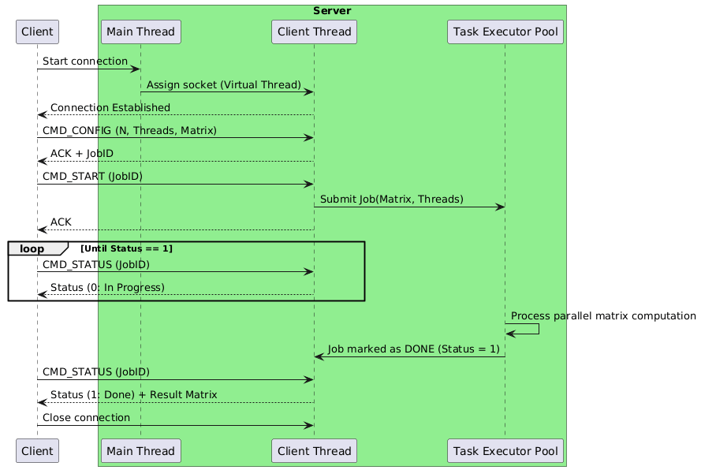

# Звіт з лабораторної роботи №3

## Елементи міжпроцесної взаємодії

### 1. Мета роботи
Детально розглянути поняття процесу, ресурсів процесу, а також підходи до міжпроцесної взаємодії, як в межах одного ПК, так і на різних ПК. Отримати практичні навички організації міжпроцесної взаємодії на прикладі написання клієнт-серверного застосунку.

### 2. Завдання
1. Розробити клієнт-серверний застосунок для вирішення завдання з лабораторної роботи номер 1 (передача масиву на сервер, обробка, повернення результату).
2. Розробити протокол прикладного рівня для взаємодії.
3. Додати підтримку декількох клієнтів одночасно.
4. Забезпечити коректну обробку виняткових ситуацій та порядку кодування байтів.
5. Описати архітектуру, протокол та надати UML діаграму.

### 3. Архітектурний опис застосунку
Застосунок побудовано за клієнт-серверною архітектурою з використанням блокуючих сокетів (API `java.net`). 
Для підтримки багатокористувацького режиму сервер використовує `Thread.ofVirtual()` (Java 21) для ізольованої обробки кожного мережевого підключення. Безпосередня обробка матриць (завдання Лабораторної №1) делегується пулу потоків `ExecutorService` (CachedThreadPool), що дозволяє не блокувати цикл спілкування з клієнтом під час тривалих обчислень. 
Для вирішення проблеми порядку байтів (endianness) застосовано класи `DataInputStream` та `DataOutputStream`, які стандартизують передачу даних у форматі Network Byte Order (Big-Endian).

### 4. Опис протоколу прикладного рівня

| Команда | Hex | Напрямок | Аргументи (Payload) | Опис команди | Можливі відповіді |
|---|---|---|---|---|---|
| `CMD_CONFIG` | `0x01` | Client → Server | `int N`, `int Threads`, `int[N][N] Matrix` | Надсилання розмірності, кількості потоків та тіла матриці. | `0x01` (ACK) + `int JobID` або `0xFF` (Error) |
| `CMD_START` | `0x02` | Client → Server | `int JobID` | Запит на початок виконання обчислень для вказаного ідентифікатора. | `0x02` (ACK) або `0xFF` (Error) |
| `CMD_STATUS` | `0x03` | Client → Server | `int JobID` | Запит статусу виконання обчислень. | `0x03` + `byte Status` (0-pending, 1-done, 2-err). Якщо 1, додається `int[N][N]` |

### 5. UML діаграма послідовності (Sequence Diagram)



### 6. Журнал роботи (Logs)
Логи Сервера:

````
Oleh@MacBook-Air-Iryna lab_3 % java -cp .. lab_3.Server
[2026-04-13 21:39:58] [SYSTEM] START - Server listening on port 8080
[2026-04-13 21:40:03] [192.168.0.242:41714] CONNECT - New client connected
[2026-04-13 21:40:04] [192.168.0.242:41714] CMD_CONFIG - Assigned JobID: 1, Size: 10x10, Threads: 4
[2026-04-13 21:40:04] [SYSTEM] PROCESS - Executing JobID: 1
[2026-04-13 21:40:04] [192.168.0.242:41714] CMD_START - Started JobID: 1
[2026-04-13 21:40:04] [SYSTEM] DONE - Completed JobID: 1
[2026-04-13 21:40:04] [192.168.0.242:41714] CMD_STATUS - Result sent for JobID: 1
[2026-04-13 21:40:04] [192.168.0.242:41714] DISCONNECT - Connection closed
[2026-04-13 21:41:49] [127.0.0.1:51900] CONNECT - New client connected
[2026-04-13 21:41:49] [127.0.0.1:51900] CMD_CONFIG - Assigned JobID: 2, Size: 10x10, Threads: 4
[2026-04-13 21:41:49] [127.0.0.1:51900] CMD_START - Started JobID: 2
[2026-04-13 21:41:49] [SYSTEM] PROCESS - Executing JobID: 2
[2026-04-13 21:41:49] [SYSTEM] DONE - Completed JobID: 2
[2026-04-13 21:41:49] [127.0.0.1:51900] CMD_STATUS - Result sent for JobID: 2
[2026-04-13 21:41:49] [127.0.0.1:51900] DISCONNECT - Connection closed
````
Логи Клієнта (Java):
````
Oleh@MacBook-Air-Iryna lab_3 % java -cp .. lab_3.Client
[2026-04-13 21:41:49] [SYSTEM] START - Initializing client
[2026-04-13 21:41:49] [SYSTEM] MATRIX_GEN - Generated Matrix:
       3       2       9       7       3       7       5       5       1       4
       4       8       5       7       2       1       3       7       5       6
       7       8       1       1       9       8       5       4       3       2
       8       8       8       3       6       8       1       3       3       3
       9       5       7       5       1       9       7       4       8       1
       1       6       6       3       2       3       8       2       3       5
       8       3       2       1       4       2       6       3       9       4
       9       3       7       8       4       5       8       8       9       8
       4       2       1       5       2       1       3       1       8       2
       2       6       6       9       3       3       1       9       1       2

[2026-04-13 21:41:49] [127.0.0.1:8080] CONNECT - Connected to server
[2026-04-13 21:41:49] [127.0.0.1:8080] SEND_CONFIG - Sent Size: 10x10, Threads: 4
[2026-04-13 21:41:49] [127.0.0.1:8080] RECV_CONFIG - Received JobID: 2
[2026-04-13 21:41:49] [127.0.0.1:8080] SEND_START - Requested start for JobID: 2
[2026-04-13 21:41:49] [127.0.0.1:8080] RECV_STATUS - Status: DONE. Received computed matrix:
       3       2       9       7       3       7       5       5       1   92160
       4       8       5       7       2       1       3       7  699840       6
       7       8       1       1       9       8       5  725760       3       2
       8       8       8       3       6       8  604800       3       3       3
       9       5       7       5       1  362880       7       4       8       1
       1       6       6       3   62208       3       8       2       3       5
       8       3       2  793800       4       2       6       3       9       4
       9       3 1270080       8       4       5       8       8       9       8
       4 3317760       1       5       2       1       3       1       8       2
 3483648       6       6       9       3       3       1       9       1       2
````
Логи Клієнта (Python):
````
/home/oleh-kuzmenko/Documents $ python3 client.py
[2026-04-13 21:40:03] [SYSTEM] START - Initializing Python client
[2026-04-13 21:40:03] [SYSTEM] MATRIX_GEN - Generated Matrix:
       9       3       1       8       4       8       6       1       6       4
       1       4       8       1       6       3       7       8       3       2
       4       3       9       8       7       3       8       8       5       3
       6       7       2       6       1       7       2       9       4       3
       1       1       3       8       8       9       8       2       2       2
       7       2       8       4       6       3       9       1       7       2
       5       3       6       6       4       1       7       3       6       7
       4       5       8       1       9       2       4       4       4       7
       8       1       8       3       5       2       8       4       1       2
       3       5       3       8       4       7       9       7       4       1

[2026-04-13 21:40:03] [192.168.0.169:8080] CONNECT - Connected to server
[2026-04-13 21:40:03] [192.168.0.169:8080] SEND_CONFIG - Sent Size: 10x10, Threads: 4
[2026-04-13 21:40:04] [192.168.0.169:8080] RECV_CONFIG - Received JobID: 1
[2026-04-13 21:40:04] [192.168.0.169:8080] SEND_START - Requested start for JobID: 1
[2026-04-13 21:40:04] [192.168.0.169:8080] RECV_STATUS - Status: DONE. Received computed matrix:
       9       3       1       8       4       8       6       1       6   28224
       1       4       8       1       6       3       7       8  483840       2
       4       3       9       8       7       3       8  387072       5       3
       6       7       2       6       1       797542144       9       4       3
       1       1       3       8       8  381024       8       2       2       2
       7       2       8       4 5806080       3       9       1       7       2
       5       3       6 1769472       4       1       7       3       6       7
       4       5 3981312       1       9       2       4       4       4       7
       8   37800       8       3       5       2       8       4       1       2
  725760       5       3       8       4       7       9       7       4       1
````

### 7. Висновки
Під час виконання лабораторної роботи було організовано міжпроцесну взаємодію на базі клієнт-серверної архітектури із використанням сокетів. 

Аналіз основних проблем при організації мережевої взаємодії та шляхи їх вирішення у розробленому застосунку:
1. **Порядок кодування байтів (Endianness):** Різні архітектури процесорів (наприклад, x86 та ARM) використовують різний порядок байтів у пам'яті (Little-Endian проти Big-Endian). Передача сирих байтів може призвести до спотворення даних. Проблему вирішено стандартизацією передачі у форматі Network Byte Order (Big-Endian) за допомогою класів `DataInputStream` та `DataOutputStream` у Java та модуля `struct` у Python.
2. **Масштабування та блокування потоків:** Синхронне обчислення матриць безпосередньо у потоці обробки мережевого запиту блокує сервер для інших клієнтів. Проблему вирішено дворівневою асинхронністю: легковагові віртуальні потоки `Thread.ofVirtual()` обслуговують мережеві з'єднання (I/O), а ізольований пул `ExecutorService` виконує паралельні математичні обчислення (CPU-bound задачі).
3. **Стан гонитви (Race Conditions):** При одночасному додаванні та видаленні завдань (`Job`) різними віртуальними потоками можливе пошкодження структур даних. Використано потокобезпечну колекцію `ConcurrentHashMap` для зберігання завдань та `AtomicInteger` для атомарної генерації унікальних `JobID`.
4. **Надійність протоколу:** Відсутність чітких меж повідомлень у TCP-потоці вимагає розробки протоколу прикладного рівня. Створено детермінований бінарний протокол, де кожна транзакція починається з 1-байтового коду команди (`0x01`, `0x02`, `0x03`), що виключає помилки парсингу та зависання при частковому отриманні пакетів.
5. **Міжмовна та міжплатформна взаємодія:** Успішне підключення клієнтів, реалізованих на Java та Python, підтвердило незалежність архітектури на базі сокетів від мови програмування за умови дотримання єдиного формату сериалізації даних та мережевих стандартів.
